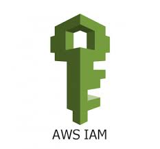
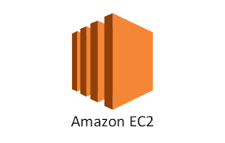

# IAM

IAM이란 Identity and Access Management의 약자로 AWS 리소스를 제어하는 권한을 중앙에서 관리할 수 있도록 도와주는 '글로벌' 서비스이다.

user에게만 권한을 부여하는 것이 아니라 EC2와 같은 인스턴스에도 접근 권한 등을 부여할 수 있다.

## Users

물리적 유저와 연동되며 AWS console을 위한 비밀번호를 가지고 있다.

## Roles

EC2나 AWS service를 위한 access 권한 관리 policy의 집합.

- EC2 Instance Roles와 같은 형태로 되어 있다.

## Policies

user나 group에 대한 권한을 부여하는 document.

- JSON 형태로 되어 있다.

- least privilege principle을 적용하여 유저에게 필요 이상의 권한을 부여하지 않는 것이 원칙이다.

## Groups

여러 user들을 묶어 Access 권한 부여 및 관리하는 것.

## MFA

Multi Factor Authentication의 약자로, password와 security device를 조합해서 사용한다.

## IAM best practice

- 하나의 물리적 유저에 대해서 하나의 AWS 유저를 부여 한다.

- user를 group에 할당하고 group을 기반으로 권한을 부여한다.

- AWS 서비스를 위한 user role을 생성한다.

---

# EC2

EC2란 Elastic Compute Cloud의 약자로, 컴퓨팅 리소스를 대여하는 AWS의 서비스이다.

## EC2 User Data

Instance를 실행할 때 한 번만 동작하는 시작 스크립트이다.

## EC2 Instance Types

[Instance-Types](https://aws.amazon.com/ko/ec2/instance-types/)

t2medium을 예로 들었을 때

- t: 인스턴스의 class(bustable 등의 유형을 나타냄)

- 3: 인스턴스의 generation(하드웨어의 성능 및 기능에 따른 특정 시기에 출시된 인스턴스 유형)

- medium: 인스턴스 class의 크기(CPU, 메모리, 스토리지, 네트워크 성능 등에 따른 차이)

## Security Groups

EC2 인스턴스에 대한 방화벽 역할을 하는 서비스이다.

- allow 규칙만 있고, deny 규칙은 없다.

- access port, IP range (IPv4/IPv6), inbound outbound를 규정한다.

- 여러개의 Instance에 붙일 수 있다.

- VPC, region의 범위로 적용이 제한된다.

- deny에 해당하는 접근은 EC2의 외부에서 차단된다.

## Purchasing options

### On-Demand Instances

- 초 단위로 비용을 지불 한다.

- 가장 비싸다.

### Reserved

- 인스턴스를 1 ~ 3년 예약.

- 최대 72%까지 할인된다.

- 선불을 어느정도 수준으로 지불할지 결정할 수 있다(할인율 달라짐).

### Savings Plans

- 1 ~ 3년간 사용량에 대한 약정

- 구독과 같은 개념으로 사용자는 미리 정해진 사용량에 대해 할인을 받을 수 있다.

- "n년간 1시간에 10$의 사용량을 쓸 수 있다" 형태.

- 최대 72%까지 할인.

### Spot Instances

- 가격은 저렴하지만 작업 중 인스턴스를 잃을 수 있음.

- 최대 90%까지 할인.

- Spot Fleets라는 서비스를 통해 자동으로 비용에 맞는 spot instance를 요청할 수 있다.

### Dedicated Hosts

- 전체 물리적 서버를 예약하고 인스턴스 배치를 제어한다.

### Dedicated Instances

- 다른 고객과 하드웨어를 공유하지 않는 전용 인스턴스.

### Capacity Reservations

- 사용 할지 안할지는 모르지만, 특정 가용 영역에서 필요한 EC2 용량을 미리 예약하고 보장 받는다.

- 예상치 못한 수요 증가나 리소스 부족으로 인해 필요한 인스턴스를 사용할 수 없는 상황을 방지하기 위해 존재한다.
