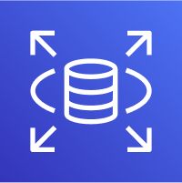
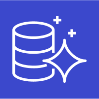

# RDS

Relational Database Service의 약자로 AWS가 관리하는 관계형 데이터 베이스이다.

- 자동화된 프로비저닝, OS 패치를 제공한다.

- 지속적으로 백업하며, 특정 시간으로 복원이 가능하다.

- 읽기 성능 향상을 위한 복제본 생성이 가능하다.

- 다중 AZ 설정이 가능하다.

- EBS의 위에서 동작한다.

- SSH 접속이 불가능하다.

## Read Replicas

- 최대 15개의 읽기 전용 복제본을 가질 수 있다.

- 단일 AZ, 교차 AZ 모두 가능하다.

- 비동기적으로 Eventual Consistency를 달성한다.

- 복제본을 그냥 DB로 승격시킬 수 있다.

- 데이터가 한 AZ에서 다른 AZ로 이동할 때 네트워크 비용이 발생한다. (동일 지역인 경우 발생하지 않음)

## Multi AZ

- 다른 AZ에 있는 standby RDS로 정보를 동기적으로 복제한다.

- 하나의 AZ에 문제가 생기거나, 네트워크가 사라진 경우 장애극복 용도로 사용된다.

- 하나의 DNS name으로 접근 가능하다.

- downtime이 0이다. (DB를 멈출 필요가 없다)

- 스냅샷이 생긴다 -> 다른 AZ에 스냅샷을 복구한다 -> 동기화가 이루어진다.

## RDS Proxy

완전 관리형 데이터베이스 프록시이다.

- app이 connection을 공유하도록 한다.

- database 자원을 덜 소모하게 만들어 효율성을 늘리고 부하를 줄인다.

- RDS와 Aurora의 장애 극복 시간을 66% 까지 줄일 수 있다.

- DB에 IAM인증을 강제한다.

- RDS Proxy는 공개적으로 접근할 수 없다.

# Aurora

AWS의 독점 기술로, 클라우드에 최적화된 RDB의 일종이다.

- Postgres 및 MySQL을 지원한다.

- RDS의 MySQL보다 5배, Postgres보다 3배 이상 향상된 성능을 제공한다.

- Aurora 스토리지는 10GB 단위로 최대 128TB까지 자동으로 증가한다.

- 즉각적 장애 극복 조치를 지원한다 (30초 이내로 장애 극복).

- RDB보다 20% 가량 비용이 더 높다.

- master와 최대 15개의 읽기 전용 복제본을 생성 가능하다.

- Cross Region 복제를 지원한다.

## Aurora Replicas

- Write Endpoint와 ReadEndpoint를 통해 읽기와 쓰기를 수행하며, 자동으로 스케일링 된다.

- Custom Endpoints를 통해 특정 Aurora instance들로 접근을 유도할 수 있다.

## Aurora Serverless

- 실제 사용량을 기반으로 자동으로 확장된다.

- 간헐적 워크로드에 적합하다.

## Global Aurora

- 기본 지역 1개와 보조 지역 5개를 선택할 수 있고, 보조 지역당 읽기 복제본 최대 16개를 가질 수 있다.

- 재해 복구를 위해 사용된다.
